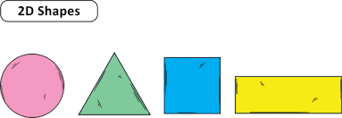
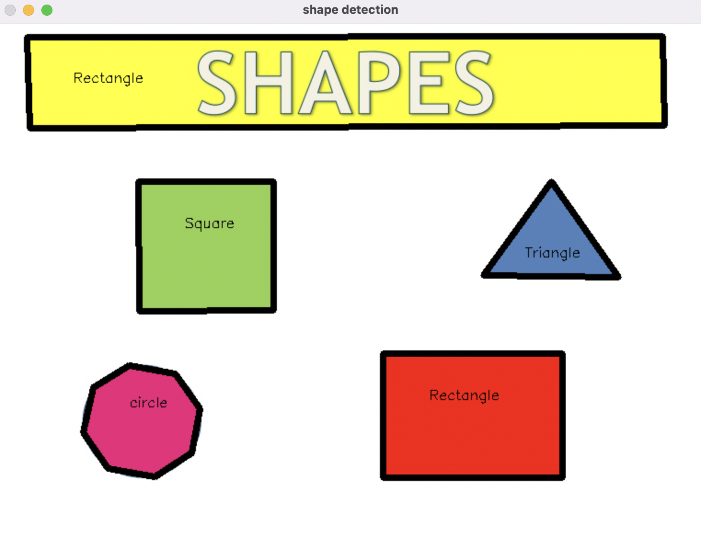

# Which package/library did you select?
    Python Library: OpenCV 
    
# What is the package/library?
    • What purpose does it serve?
    The OpenCV is python computer vision library. It provides tools for image processing tasks. [1]
    Some of the major tasks it helps with are:
    1. Image processing
    2. Feature Detection 
    3. Object Recogniton
    4. Video analysis

    • How do you use it?
    To use it:
    1. Make sure this package is installed on your system. If it is not you can install using command 'pip install opencv-python'
    2. Then import the package in your program using command 'import cv2'
    3. Now you are free to use plenty of functions this package offers. 

    • This section should be the largest and go into lots of detail. Not everything here must
be utilized in your sample program.
# What are the functionalities of the package/library?

Some of the functionalities of the package is as follows:

1. flip(arg1, arg2) method:
This helps to flip the image. For instance below line of code turns the image vertically.
    flippedImage = cv2.flip(imageToFlip, 0)
The two arguments are : 
a. Image you want to flip
b. code which is used to determine how the image is flliped. 0 for vertical flip and 1 for horizontal flip.

before fliping: 

after flipping:

2. blur(arg1 , arg2) method:
This helps in blurring an image. You can manipulate the amount of blurrness you want.
For instance, the code below blurs an image named clearImage:
size = (20,20)
blurredImage = cv2.blur(clearImage, size)

before blurring:

after blurring:

**_NOTE:_**: Size here is a tuple which represents nothing but width and height of a pixel. More the size, more blur is the image

3. Shape detection:
Using method, findContour(), we get the coordinates of the edges of the shapes as it looks the grayscale version of the original image to recognize the edge
then, using drawContour(), we draw the edges of the required color on our output image.

input image: 

output image:

# When was it created?
OpenCV was released in June 2000 by Intel, Willow Garage, Itseez.

# Why did you select this package/library?
    I chose this package because of the advance functions it provides like face detetor model and tools to help with machine learning. 

# How did learning the package/library influence your learning of the language?
    I was never aware of the fact that python has such built in functions to work with images and videos. 

# How was your overall experience with the package/library?
    • When would you recommend this package/library to someone?
    Yes, I would recommend this library to anyone working with images and videos. If someone is working on stuff like image detection and object recognition, this package is definitly recommended.

    • Would you continue using this package/library? Why or why not?
    Yes definitly, i would continue using this package.